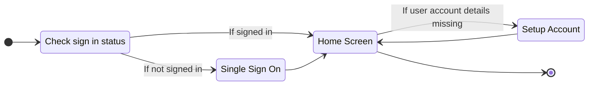
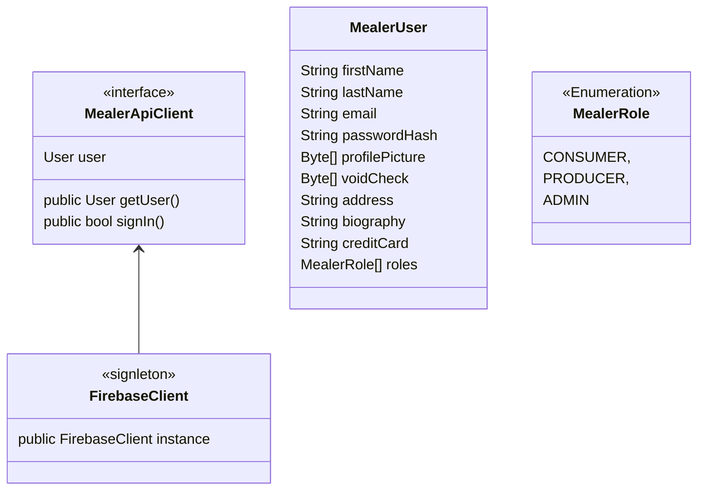
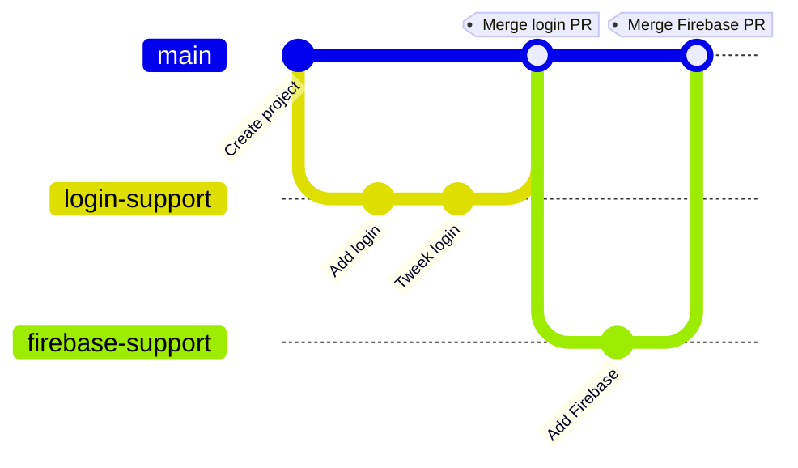

# Project Mealer - Group 8

## Login Architecture

### Api (Firebase)

User experience:

We use `FirebaseUI` for Signle Sign On. This enables users to use multiple account providers with Mealer.

Setup Account populates Firebase's `Cloud Firestore` with data.

API Architecture:

## Contributions

<b style="color:red">Ne contribuer pas directement à main!</b>

Nous utilisons des [Pull Request](https://docs.github.com/en/pull-requests/collaborating-with-pull-requests/proposing-changes-to-your-work-with-pull-requests/creating-a-pull-request) pour contribuer. Quelqu'un de l'équipe peut te montrer comment faire.

## Firebase

Nous utilisons [Firebase](https://firebase.google.com/docs/reference/android/packages) comme base de données. Envoyer un message à quelqu'un de l'equipe pour avoir access.
