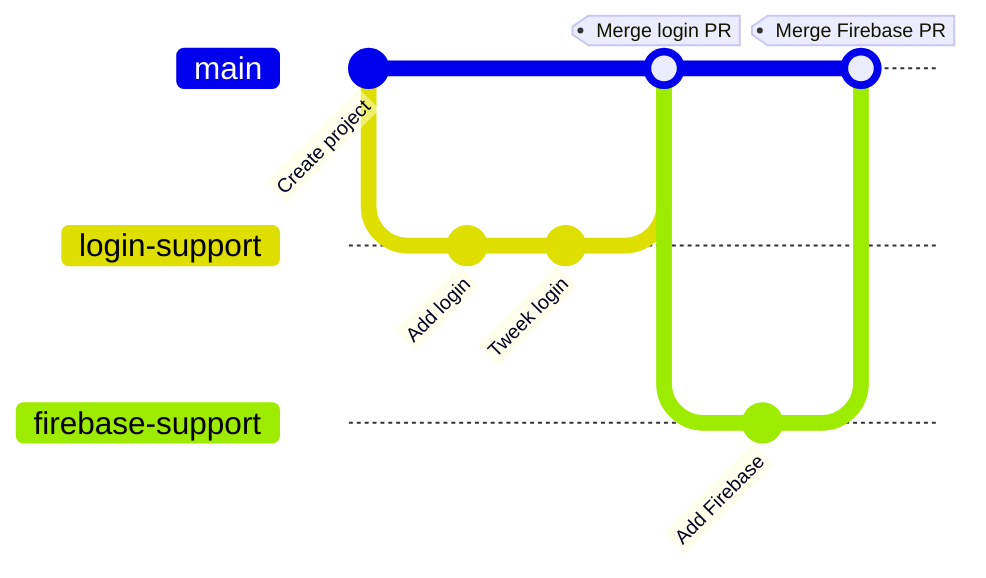

# Project Mealer - Group 8

## Contributions

<b style="color:red">Ne contribuer pas directement à main!</b>

Nous utilisons des [Pull Request](https://docs.github.com/en/pull-requests/collaborating-with-pull-requests/proposing-changes-to-your-work-with-pull-requests/creating-a-pull-request) pour contribuer. Quelqu'un de l'équipe peut te montrer comment faire.
