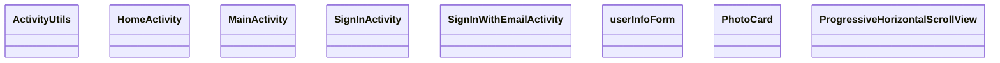

# Project Mealer - Group 8

## Getting started

To get started, you will need `Android Studio`. Once you've opened the project, please accept any requests to download plugins. This project currently depends on the [Save Actions](https://plugins.jetbrains.com/plugin/7642-save-actions).

[Save Actions](https://plugins.jetbrains.com/plugin/7642-save-actions) ensures unified imports and code formating is applied to all contributed code.

Once your IDE is setup, see [Contributions](#contributions) for information on how to contribute to the project.

## Login Architecture

### Api (Firebase)

User experience:

We use `FirebaseUI` for Signle Sign On. This enables users to use multiple account providers with Mealer.

Setup Account populates Firebase's `Cloud Firestore` with data.

Architecture:

<b style="color:red">Not all methods are implemented yet. Please add it if you need it.</b>

## Contributions

<b style="color:red">Ne contribuer pas directement à main!</b>

Nous utilisons des [Pull Request](https://docs.github.com/en/pull-requests/collaborating-with-pull-requests/proposing-changes-to-your-work-with-pull-requests/creating-a-pull-request) pour contribuer. Quelqu'un de l'équipe peut te montrer comment faire.

## Firebase

Nous utilisons [Firebase](https://firebase.google.com/docs/reference/android/packages) comme base de données. Envoyer un message à quelqu'un de l'equipe pour avoir access au projet Firebase.

## Attributions
<a href='https://pngtree.com/so/Eat'>Eat png from pngtree.com/</a>
<a href='https://pngtree.com/so/cute'>cute png from pngtree.com/</a>